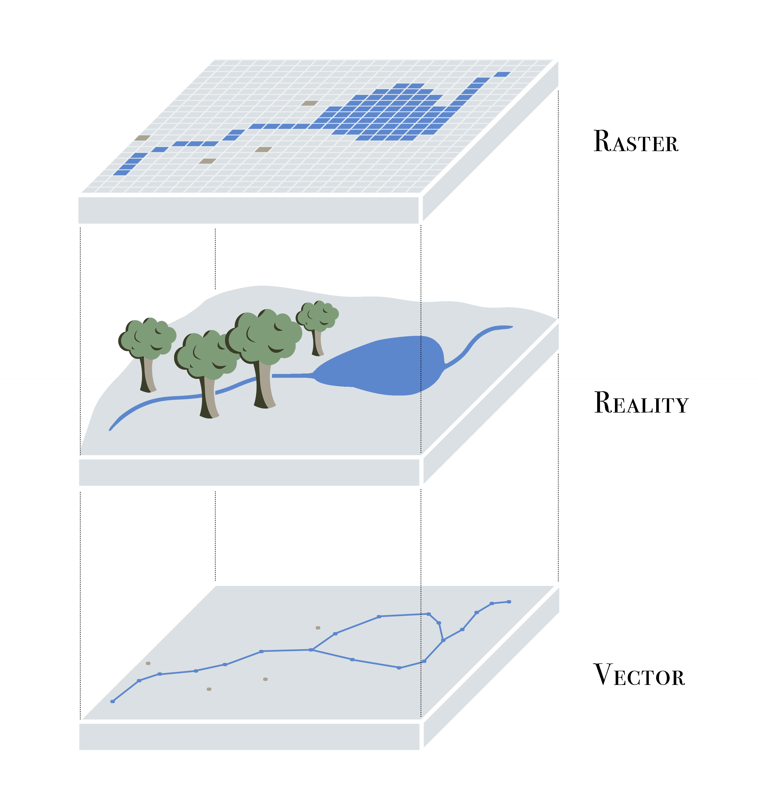
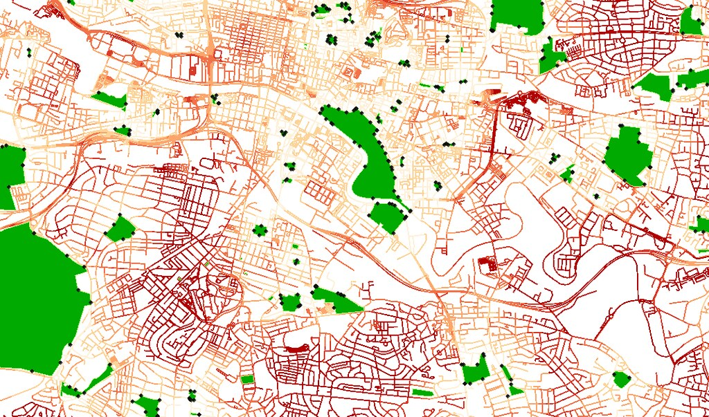

# Spatial Orientation

## Defining spatial data {#SD-spatial-data}

Spatial data refers to data that contain information about specific locations, and the information content of the data may change with location. In other words, "information" and "location" are two important elements in spatial data. On some occasions, spatial data may only include "location." But without "location," the data is no longer spatial anymore. For example, a spatial data that describes the resource distribution of Medications for Opioid Overuse Disorder (MOUDs) must contain *and enable* location information of these MOUD resources, otherwise the data becomes a non-spatial list of those resources.

For the purpose of this tutorial, we will only briefly introduce some important concepts in spatial data. See *Further Resources* if you would like to learn more about these concepts.

## Spatial data formats {#SD-vector-data}

Spatial data can be stored in a text file like comma-separated value (CSV) files. However, the text file needs to have essential location columns with latitude and longitude to represent the coordinate location of a spatial object. Furthermore, a CSV file with lat/long columns is only a flat/non-spatial file, until the spatial location context is enabled as a new spatial data format.

A common spatial data format is the shapefile, which comes from ESRI/ArcGIS proprietary software. The shapefile file format (.shp for short) includes a minimum of 4 files, with a common prefix and different filename extensions `.shp`, `.shx`, `.dbf`, and `.prj`. In order to work with the spatial data, we need all these four components of the shapefile stored in the same directory, so that the software (such as R) can know how to project spatial objects onto a geographic or coordinate space (i.e., spatial location context is enabled). Other common spatial data formats include the GeoJSON, KML, and geopackage.

### Simple features

[Simple features](https://r-spatial.github.io/sf/articles/sf1.html) refers to an international standard (ISO 19125-1:2004) that describes how real-world objects, and their spatial geometries, are represented in computers. This standard is enabled in ESRI/ArcGIS architecture, POSTGIS (a spatial extension for PostGresSQL), the GDAL libraries that serve as underpinnings to most GIS work, and GeoJSONs. The `sf` R ecoystem makes simple features even more accessible within R, so that simple feature objects in spatial data are also stored in a data frame, with one vector/column containing geographic data (usually named "geometry" or "geom").

Why should you care about these computational components of spatial systems architecture? Spatial analysis often requires troubleshooting, and spatial formats can be complicated.

We recommend using the `str` function in R to familiarize yourself with data objects as you go, and to explore the data files as well. For example: a `shapefile` includes (at least) four components, separating the data as a `.dbf` file and projection information as a `.prj` file. In contrast, the `sf` spatial file loaded in your R environment is one unified object, has the spatial information recorded as a geometry field, and projection stored as metadata.

## Spatial data types

Two common formats of spatial data are vector and raster data. Vector data represents the world surface using **points, lines, and polygons** whereas raster data can be satellite imagery or other pixelated surface. The figure below demonstrates how vector and raster data models represent geographic space differently, where points, lines, and polygons consist of the essential basis of the vector data model.

```{r, echo=F, fig.align = 'center', fig.cap="Vector and raster data model in geographic space"}

```

We mainly use vector data for our purpose. For example, a group of clinics can be geocoded and converted to points, whereas zip code boundaries are represented as polygons. Note that spatial data types include the basic attributes *in addition to* their spatial information. So points on a map correspond to associated details for each clinic provider, and may also include fields like "name", "services", and more. For example, each park is represented as a green polygon in the figure below. Linked with each park, we can have information regarding their names, sizes, types of plants, open hours, and other various features. These attributes can be stored in a data table, along with their spatial inforamtion, in a `shapefile`, or a `sf` spatial file loaded in your R environment.

```{r, echo=F, fig.align="center", fig.cap="[Glasgow park access  network](https://www.flickr.com/photos/29266908@N02/8520851663) by [macrofight](https://www.flickr.com/photos/29266908@N02) is under [CC BY-SA 2.0](https://creativecommons.org/licenses/by-sa/2.0/?ref=ccsearch&atype=rich)"}

```

Read more regarding vector and raster data from [Chapter 2 Geographic data in R](https://geocompr.robinlovelace.net/spatial-class.html#intro-sf) of the Lovelace et al 2019 text, [Geocomputation with R](https://geocompr.robinlovelace.net/). This opensource text is an incredible resource for those who are interested in learning more details regarding geographic data analysis, visualization, and modeling, and represents one of dozens of resources available for learning and honing R & spatial analysis skills.
