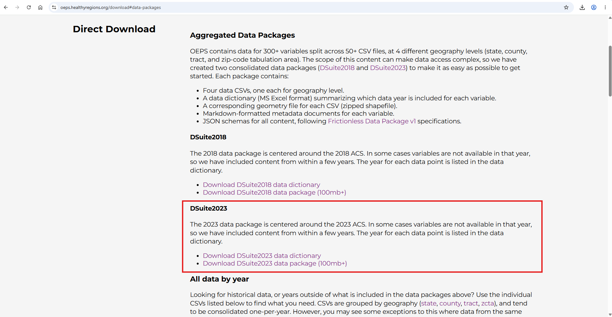
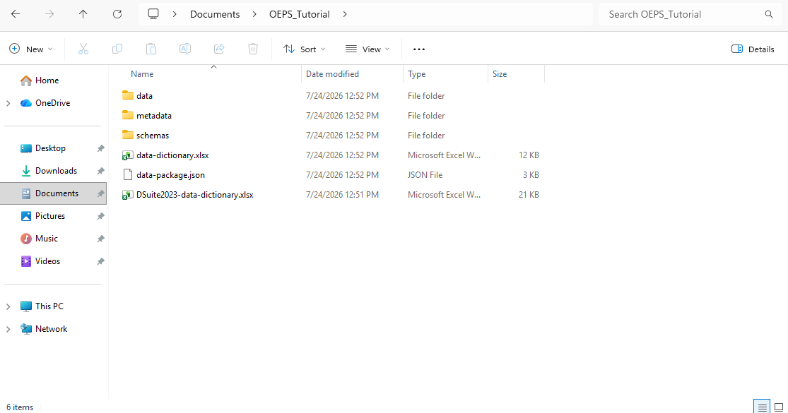
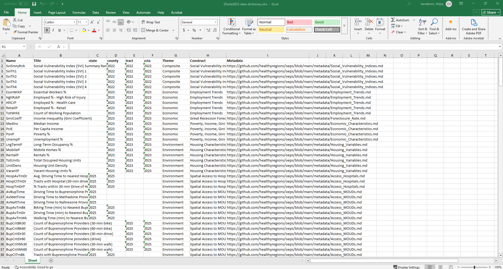
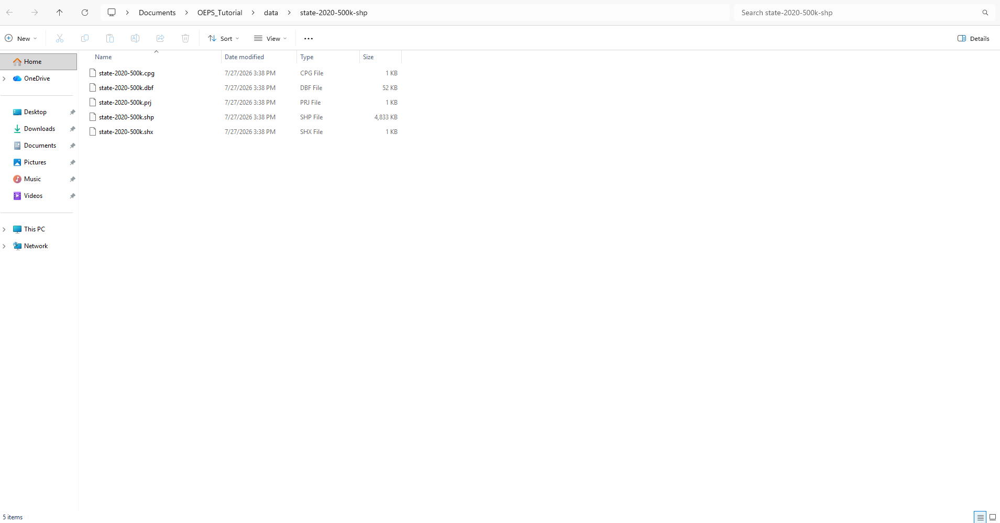

# OEPS {#intro}

## Overview

The Opioid Environment Policy Scan Data Warehouse, otherwise known as OEPS, is a data resource and warehouse with nationwide health, policy, and community data related to the opioid crisis, available to download, analyze, and visualize at multiple spatial scales. It integrates social and structural determinants of health, which are grouped thematically. It currently includes more than 50 variable constructs with the data available for download as CSV files which can be easily merged with geographic shapefiles. This is a project led by the Healthy Regions and Policies Lab (HEROP) at the University of Illinois Urbana-Champaign.

This tutorial will show you how to: \

1. Download Opioid Environment Policy Scan (OEPS) data directly from the website \
2. Navigate the OEPS data suite \
3. Set up an R project \
4. Prepare the state-level data for analysis and visualization \
5. Prepare the county-level data for analysis and visualization \
6. Join OEPS data to outside data \
7. Save outputs \

## Download OEPS Data

First, go to the OEPS website: **[https://oeps.healthyregions.org/](https://oeps.healthyregions.org/){target="_blank"}**. If this is your first time visiting the site, take a moment to explore the **[About OEPS](https://oeps.healthyregions.org/about){target="_blank"}**, **[Methodology](https://oeps.healthyregions.org/methods){target="_blank"}**, and **[Data Standards](https://oeps.healthyregions.org/dataInclusion){target="_blank"}** tabs to get familiar with site.

Next, under the **Data** section, click **Data Download**, or go directly to  **[https://oeps.healthyregions.org/download](https://oeps.healthyregions.org/download){target="_blank"}**. 

On this page, Click **Aggregated Data Packages**.

This tutorial uses data from the 2023 ACS release, which is a 5-year pooled estimate covering 2019-2023.

Under the **DSuite2023** heading, download both of the following files:\

* **DSuite2023 data dictionary**\
* **DSuite2023 data package (100mb+)**. 

See screenshot below.

```{r, echo=FALSE, out.width="100%"}

```

\
After downloading the files, create a new folder on your computer called **OEPS_Tutorial** and save the files there. If the data package downloads as a .zip file, open your Downloads folder, and extract the contents into your **OEPS_Tutorial** folder before continuing. 

We also encourage you to pin this folder to Quick Access.

See the screenshot below. 

```{r, echo=FALSE, out.width="100%"}

```
\

## Navigate the Data Suite

Now, that the files have been downloaded, we will take a closer look at the OEPS data suite.

Open **DSuite2023-data-dictionary.xlsx**. 

```{r, echo=FALSE, out.width="100%"}

```

The data dictionary explains the contents of the data package including what variables are available at what geography. The columns are:

* **Name:** the exact variable name used in the dataset 
* **Title:** the variable label
* **state:** the year for which state-level data are available
* **county:** the year for which county-level data are available
* **tract:** the year for which tract-level data are available
* **zcta:** the year for which ZIP Code Tabulation Area data are available
* **Theme:** the broad thematic group
* **Construct:** the subtopic within each theme
* **Metadata:** a link to the variable metadata, which is also stored in the **metadata** folder

To learn more about each variable, explore the **metadata** folder or navigate to the **Documentation** page on the OEPS website or go directly to [https://oeps.healthyregions.org/docs](https://oeps.healthyregions.org/docs){target="_blank"}. 

## Set Up Your R Project

Next, open RStudio and create a new R script called **OEPS_Tutorial_RScript.R**. Save it in your **OEPS_Tutorial** folder.

In the Files pane (usually on the bottom right-hand side), click the three dots on the right side, navigate to your **OEPS_Tutorial** folder, and click **Open**. Then click the gear icon and select **Set As Working Directory**.

If the Files pane is not open, click **View** in the main toolbar and then click **Show Files**.

If you have not already installed **tidyverse**, **sf**, and **tmap**, install them first using **install.packages("PackageName")**. Then load them with the library() function.

```{r package, message=FALSE, warning=FALSE}
## Load required packages
library(tidyverse)
library(sf)
library(tmap)
```

## Prepare the State-Level Data for Analysis and Visualization {#BA-setup}

### Explore the State-Level Dataset {#BA-i-o}

Now, we will read in the state-level CSV file and inspect its contents. 

```{r read, include=TRUE}
## Read state.csv
state_data <- read.csv("data/state.csv")

## Glimpse state_data
glimpse(state_data)
```

The state-level dataset contains 56 rows, which represent the 50 states plus the District of Columbia and U.S. territories. It also contains 83 columns, each representing a different variable. 

The glimpse() function shows the structure of the dataset, including each variable's type and a preview of its values. 

You can also view the loaded dataset by clicking on the name in the **Environment** tab.

### Choose a Variable to Explore

For this tutorial, we will explore Hepatitis C (HCV) mortality as an example health outcome variable. The same workflow can be used to explore other health outcomes. 

Open the **HepatitisC_Rates.md** in the **metadata** folder and read through the contents. The OEPS Hepatitis C (HCV) data was orginially sourced from [HepVu](https://hepvu.org/){target="_blank"}. HepVu includes single-year data from 2018-2022. OEPS researchers cleaned and prepared this data for analysis by aggregating the multiple single year datasets into a single multi-year state-level dataset for 2018-2022. 

Hepatitis C, also referred to as HCV, is relevant to opioid-environment research because injection drug use is one of the most common risk factors for HCV infection. People who use drugs are therefore at elevated risk for HCV. HCV can lead to chronic infection, serious liver disease, and/or death if left untreated. For these reasons, HCV is often used as a related health outcome in opioid research.

In the **DSuite2023-data-dictionary.xlsx**, in the **Construct** column, scroll to **Hepatitis C Rates**. You will see several variables related to HCV deaths by age, race, and ethnicity. 

For simplicity, we will use **AvHcvD**, which is the average annual number of HCV deaths from 2018-2022. This variable is only available at the state-level in the OEPS database. While HepVu does include county-level HCV mortality, the data is a calculated estimation. For a complete description of the data, see HepVu's [Data Methods](https://hepvu.org/data-methods/){target="_blank"}.

Return to RStudio and locate the **AvHcvD** variable in **state_data**. You will see that the row with FIPS code 35, which corresponds to New Mexico, has an average annual HCV death count of 159 people.

To check which FIPS code corresponds to which state or territory, visit [this page](https://www.census.gov/library/reference/code-lists/ansi/ansi-codes-for-states.html){target="_blank"} from the U.S. Census Bureau. 

### Create a Population-Adjusted Measure

Next, we will prepare the data and generate descriptive statistics for the health outcome variable.

The **AvHcvD** variable is a raw count. Because states have different population sizes, we will standardize this measure by dividing **AvHcvD** by **TotPop**, the total population. 

We will call this new variable **PropHcvD**. It represents the average annual proportion of the total state population that died from HCV. 

We use total population as the denominator, rather than total HCV cases because of data availability constraints. Data for average annual HCV cases is only available as a 5-year pooled estimate covering 2013-2016. Whereas, this tutorial is using pooled mortality data from 2018-2022.

```{r prop, include=TRUE}
## Create a population-adjusted variable
state_data$PropHcvD <- (state_data$AvHcvD / state_data$TotPop)

## View the first few values
head(state_data$PropHcvD)

```


### Summarize the Variable

Next, use the summary() function to examine the distribution of **PropHcvD**. This output includes the mean, median, minimum, maximum, first quartile, third quartile, and the count of missing values.

```{r desc, include=TRUE}
## Summarize new variable
summary(state_data$PropHcvD)

```

Because these values are very small, they can be difficult to interpret directly. Additionally, the output shows five missing values, which we will address in a later section.


### Re-express the Variable Per 100,000 People

To make the variable easier to interpret, multiply **PropHcvD** by 100,000. This gives the average annual HCV deaths per 100,000 people. We will call this new variable **AvHcVD100K**.  

```{r recalc, include=TRUE}
## Re-express the variable per 100,000 people
state_data$AvHcvD100K <- state_data$PropHcvD * 100000

```


### Identify Missing Values

Now we will identify the rows with missing values for **AvHcvD100K**. 

```{r NAs, include=TRUE}
## View the rows with missing AvHcvD100K data
state_data[is.na(state_data$AvHcvD100K),]

```

These missing values correspond to American Samoa (60), Guam (66), Northern Mariana Islands (69), Puerto Rico (72), and the U.S. Virgin Islands (78). For these locations, the dataset does not include HCV deaths or total population values.  

### Filter the Dataset

For the remainder of this tutorial, we will limit the analysis to the contiguous U.S., which will also make the mapping step easier. This excludes the territories listed above, as well as Alaska (02), and Hawaii (15).

```{r contigUS, include=TRUE}
## Filter to the contiguous U.S.
state_data_filtered <- state_data %>% filter(!FIPS %in% c(02, 15, 60, 66, 69, 72, 78))

```

### Summary Statistics

Now that **AvHcvD100K** has been calculated and processed, use the summary() function again to examine the distribution.

```{r descagain, include=TRUE}
## Summarize new variable
summary(state_data_filtered$AvHcvD100K)

```
From this output, we can see the typical range of values across states and identify whether any states have unusually high or low rates. The summary also helps us confirm that the missing values have been removed from the filtered dataset.

The average annual HCV death rate ranges from 1.921 to 13.416 deaths per 100,000 people across states in the contiguous U.S. The median rate is 3.949 and the mean rate is 4.642, which is higher than the median, suggesting that the distribution is slightly right-skewed, with a few states having relatively high rates.

The distribution suggests that HCV mortality is not uniform across states. But it is important to note that summary statistics alone cannot tell us why rates differ.

### Load the State Shapefile

Now that the data has been prepared, we can create a map of the outcome variable. 

Before we can map the data, we need to join the state-level dataset to a state shapefile. The shapefile is included in the OEPS data suite.

In your **OEPS_Tutorial** folder, open the **data** folder and locate **state-2020-500k-shp.zip**. If the file is still compressed, unzip it first. For best organization, create a folder named **state-2020-500k-shp** inside the **data** folder and extract the shapefile contents there. 

See the screenshot below.

```{r, echo=FALSE, out.width="100%"}

```

Now load the shapefile into R and display the geometry column to confirm that it imported correctly. 

```{r spfile, message=FALSE, warning=FALSE, out.width="100%"}
## Load in the state shapefile
state_geom <- st_read("data/state-2020-500k-shp/state-2020-500k.shp")

## Create a quick plot
plot(state_geom$geometry)

```

### Filter to the Contiguous U.S.

Next, filter the shapefile to include only the contiguous U.S. This excludes Alaska, Hawaii, and the U.S. territories. 

```{r contigUSshp, include=TRUE, out.width="100%"}
## Filter to the contiguous U.S.
state_geom_filtered <- state_geom %>% filter(!STATEFP %in% c("02", "15", "60", "66", "69", "72", "78"))

## Check plot
plot(state_geom_filtered$geometry)

```


### Join the Data to the Shapefile

Now join the **state_data_filtered** dataframe to the filtered shapefile. We join using **HEROP_ID** which serves as a unified geographic identifier for joins. To read more about this variable [click here](https://oeps.healthyregions.org/methods){target="_blank"}.

```{r join, include=TRUE}
## Join state_data_filtered to state_geom_filtered
data_to_map <- state_geom_filtered %>%
  left_join(state_data_filtered, by = "HEROP_ID")

```


### Create a Map

Finally, map **AvHcvD100K**, which represents the average annual HCV death rate per 100,000 people.

```{r map, include=TRUE, out.width="100%"}
# Map
tm_shape(data_to_map) +
  tm_polygons(
    fill = "AvHcvD100K",
    fill.scale = tm_scale_intervals(
      values = c("white", "#FFF7BC", "#FEC44F", "#FE9929", "#D95F0E", "#993404"),
      breaks = c(0, 0.0000001, 3.99999, 6.99999, 9.99999, 11.99999, 14.99999),
      labels = c("0", "1–3", "4–6", "7–9", "10–12", "12-14"),
      label.na = ""
    ),
    fill.legend = tm_legend(title = "")) +
  tm_title("Average Annual Hepatitis C (HCV) Deaths per 100,000 People")

```

The map suggests that HCV death rates are not evenly distributed across the U.S. Instead, several Southern and Western states appear to have higher rates compared to Northeastern states. Oklahoma appears to have the highest rate of annual HCV deaths.  

## Prepare the County-Level Data for Analysis and Visualization

OEPS includes data at multiple geographic levels. In this section, we will demonstrate how the state-level workflow can be applied to county-level data. Additionally, we will show how to subset the data to a single state for closer examination.

### Explore the County-Level Dataset

Now, we will read in the county-level CSV file and inspect its contents. 

```{r readcty, include=TRUE}
## Read county.csv
county_data <- read.csv("data/county.csv")

## Glimpse state_data
glimpse(county_data)
```

The county-level dataset contains 3,234 rows representing individual counties and 100 columns representing different variables.

The glimpse() function shows the structure of the dataset, including each variable's type and a preview of its values. 

### Choose Variables to Explore

Next, we will identify a few variables to explore.

Open **DSuite2023-data-dictionary.xlsx**. Explore the variables that have a year listed under the **county** column. These are variables where data exists at the county-level. 

For this tutorial, let's focus on **PovP**, the number of individuals earning below the poverty income threshold as a percentage of the total population. Open **Economic_Characteristics.md** in the **metadata** folder to read about this variable.

Additionally, let's look at **FqhcAvTmDr**, the average driving time (minutes) across tracts in state to nearest Federally Qualified Health Center (FQHC). Open **Access_FQHCs.md** in the **metadata** folder to read about this variable.

```{r summaryvars, include=TRUE}
## Summary statistics for PovP
summary(county_data$PovP)

```

The county-level poverty percentage ranges from 1.7 to 52.8%. The median is 13.3% and the mean is 14.26%, suggesting that the distribution is slightly right-skewed, with few counties having high percentages. There are 99 counties with no percent poverty data.

```{r summaryvars2, include=TRUE}
## Summary statistics for FqhcAvTmDr
summary(county_data$FqhcAvTmDr)

```

The county-level average driving time to nearest FQHC ranges from 0 to 89.82 minutes. The median is 14.13 minutes and the mean is 20.85 minutes, which suggests that most counties are relatively close to an FQHC, but some are much further away. There are 168 counties with missing data, which corresponds to the worst access, where travel takes over 90 minutes in optimal conditions, or 180 minutes in normal conditions.

### Filter the Dataset to a Single State

Next, we filter the county dataset to just counties in a single state using the **HEROP_ID** variable. In this tutorial, we will zoom in on North Carolina. 

The **HEROP_ID** consists of four parts:

* The 3-digit summary level code for counties: 050
* The string: US
* The 2-digit state FIPS code
* The 3-digit county FIPS code

In the following code, we filter by the 6th and 7th positions of the HEROP_ID string which correspond to the 2-digit state FIPS code. North Carolina's FIPS code is 37.

To check which FIPS code corresponds to which state or territory, visit [this page](https://www.census.gov/library/reference/code-lists/ansi/ansi-codes-for-states.html){target="_blank"} from the U.S. Census Bureau. 

```{r filter1, include=TRUE}
## Filter to a single state
county_data_filtered <- county_data %>%
  filter(substr(HEROP_ID, 6, 7) %in% c("37"))

## View the first few values
head(county_data_filtered)

```

### Load the County Shapefile

Before we can map the data, we need to join the filtered dataset to a county shapefile. The shapefile is included in the OEPS data suite.

In your **OEPS_Tutorial** folder, open the data folder and locate **county-2020-500k-shp.zip**. If the file is still compressed, unzip it first. For best organization, create a folder named **county-2020-500k-shp** inside the **data** folder and extract the shapefile contents there.

Now, load the shapefile into R and display the geometry column to confirm that it imported correctly.

```{r spfile2, message=FALSE, warning=FALSE, out.width="100%"}
## Load in the county shapefile
county_geom <- st_read("data/county-2020-500k-shp/county-2020-500k.shp")

## Create a quick plot
plot(county_geom$geometry)

```

### Filter Shapefile to a Single State

Next, filter the shapefile to only include North Carolina counties. 

```{r ctyfilter, message=FALSE, warning=FALSE, out.width="100%"}
## Filter to a single state
county_geom_filtered <- county_geom %>% filter(STATEFP %in% c("37"))

## Check plot
plot(county_geom_filtered$geometry)

```

### Join the Data to the Shapefile

Now join the **county_data_filtered** dataframe to the filtered shapefile.

```{r joinagain, include=TRUE}
## Join county_data_filtered to county_geom_filtered
data_to_map_county <- county_geom_filtered %>%
  left_join(county_data_filtered, by = "HEROP_ID")

```

### Create Maps

Finally, map **PovP**, the number of individuals earning below the poverty income threshold as a percentage of the total population and **FqhcAvTmDr**, the average driving time (minutes) across tracts in state to nearest Federally Qualified Health Center (FQHC).

```{r map2, include=TRUE, out.width="100%"}
## Map PovP
PovP <- tm_shape(data_to_map_county) +
  tm_polygons(
    fill = "PovP",
    fill.scale = tm_scale_intervals(style = "jenks"),
    fill.legend = tm_legend(title = ""),
    col = "grey85",
    lwd = 0.2) +
  tm_title("% of Individuals Earning Below Poverty Income Threshold")

## Map FqhcAvTmDr
FqhcAvTmDr <- tm_shape(data_to_map_county) +
  tm_polygons(
    fill = "FqhcAvTmDr",
    fill.scale = tm_scale_intervals(style = "jenks"),
    fill.legend = tm_legend(title = ""),
    col = "grey85",
    lwd = 0.2) +
  tm_title("Driving time (minutes) to nearest FQHC") 

## Arrange the maps
tmap_arrange(PovP, FqhcAvTmDr)

```

The **PovP** map shows us that poverty is unevenly distributed across the state. Poverty percentages appear higher in several Eastern and Southern counties, whereas many counties in the central Piedmont have lower poverty rates.

For the **FqhcAvTmDr** map, most counties appear to have relatively short driving times, especially in the central part of the state. Longer travel times seem more common in some coastal and mountain areas, where access may be more limited. There are no counties that exceed a driving time of 58 minutes.


## Join OEPS data to outside data

Sometimes users will already have their own data and want to add OEPS variables for context. In this section, we will demonstrate how to join OEPS county-level data to an outside dataset using a shared geographic identifier. 

The **NC_cty_foodstamps_2025.csv** contains information about the county-level prevalence of food stamps in North Carolina for 2025, which was originally pulled from [CDC's PLACES](https://www.cdc.gov/places/index.html){target="_blank"} dataset.

```{r readoutside, include=TRUE}
## Read in non-OEPS data
foodstamps_data <- read.csv("data/NC_cty_foodstamps_2025.csv")

## Glimpse foodstamps_data
glimpse(foodstamps_data)
```

Often times, datasets will have a **FIPS** or **GEOID** column that can be used for joining to other datasets. Sometimes, these columns will not be the same format, in which case, joining will not work. Thus, you will need to re-format the columns before joining.

In **foodstamps_data**, we have a column called **StateFIPS** which stores the 2-digit state FIPS code and a **CountyFIPS** column which stores the 3-digit county FIPS code. However, CSV files often delete leading zeros, which is why you see some 1- or 2-digit values in **CountyFIPS**.

Let's check again to see what identifier columns are in **county_data_filtered**.

```{r glimpse, include=TRUE}
## Glimpse county_data_filtered
glimpse(county_data_filtered)
```

In **county_data_filtered**, we have **HEROP_ID**, our unique OEPS identifier and **FIPS** which stores the 5-digit combined state and county FIPS codes.

It is obvious that the two datasets we want to join do not have a shared geographic identifier. But, we have all the information we need to create one!

Let's keep the OEPS data as is, and instead alter **foodstamps_data** by creating a 5-digit FIPS column. To do so, we need to combine **StateFIPS** with **CountyFIPS** ensuring that **CountyFIPS** does not leave out leading zeros.

```{r create, include=TRUE}
## Create a FIPS column
foodstamps_data <- foodstamps_data %>%
  mutate(FIPS = as.numeric(sprintf("%02d%03d", StateFIPS, CountyFIPS)))

## View the first few values
head(foodstamps_data)
```

Now we have a shared geographic identifier, **FIPS**, and can join the two datasets.

```{r joinoutside, include=TRUE}
## Join foodstamps_data to county_data_filtered
final_county_data <- county_data_filtered %>%
  left_join(foodstamps_data, by = "FIPS")

## Glimpse final_county_data
glimpse(final_county_data)

```

From here, you could use this dataset for further analysis and visualization. 

## Save Outputs

Finally, let's save our outputs. We will save the final joined dataset as a CSV, and the county-level maps as images.

```{r save, include=TRUE, message = FALSE}
## Save final_county_data
write.csv(final_county_data, "final_county_data.csv")

## Save county-level maps
tmap_save(PovP, filename = "PovP_map.png")
tmap_save(FqhcAvTmDr, filename = "FqhcAvTmDr_map.png")

```

## More Resources

To learn more about the OEPS ecosystem visit: [https://oeps.healthyregions.org/](https://oeps.healthyregions.org/){target="_blank"}

Visit the Geospatial Consortium & Community of Practice website to learn about past and upcoming workshops: [https://gccp.healthyregions.org/](https://gccp.healthyregions.org/){target="_blank"}

For more on the tmap package visit: [https://r-tmap.github.io/tmap/reference/](https://r-tmap.github.io/tmap/reference/){target="_blank"}

