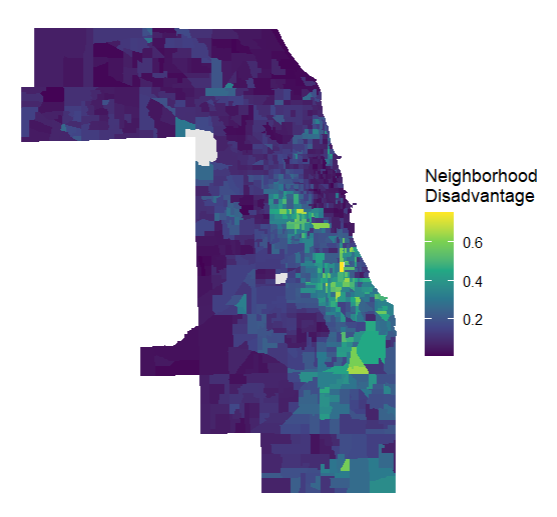
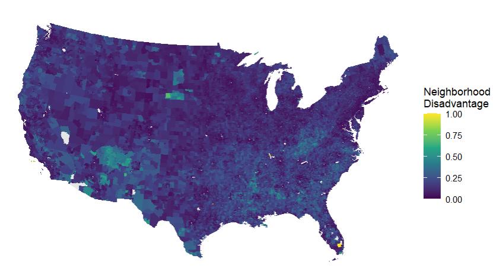

# SDOH & Place

## Overview

Finding data about the Social Determinants of Health (SDOH) and community context can be difficult. Data are often distributed across federal agencies, universities, local governments, research repositories, and other organizations. Even after identifying a useful dataset, additional work is usually required to understand the geographic scale, time period, file structure, identifiers, and documentation before the data can be integrated into a spatial analysis.

The **SDOH & Place Project** was developed to make this process easier. The project brings together spatial data science, health equity research, and human-centered design to help researchers, advocates, students, planners, and community organizations find and use place-based SDOH data.

Two major resources developed through the project are:

-   the [Community Toolkit](https://toolkit.sdohplace.org/), which provides tutorials for working with SDOH data, place-based visualization, and community-centered GIS applications; and
-   the [Data Discovery](https://search.sdohplace.org/) search tool, which helps users identify curated SDOH datasets by topic, geography, place, and time period.

The Data Discovery platform is primarily a search and metadata tool. It helps users identify relevant datasets and directs them to the organization or repository where the underlying data can be downloaded.

In this tutorial, we demonstrate how to use the Data Discovery platform to locate a community-level socioeconomic dataset, download the data from its source repository, inspect the downloaded files in R, connect the data to census tract boundaries, and map **neighborhood disadvantage**.

Our objectives are to:

-   Search for community-level SDOH data using the SDOH & Place Data Discovery platform
-   Identify the appropriate dataset, geography, and time period
-   Navigate and inspect a downloaded data package in R
-   Load and explore an R data file
-   Prepare Census GEOIDs for integration
-   Join community data to a spatial census tract boundary
-   Select a specific county for analysis
-   Map neighborhood disadvantage for a county
-   Map neighborhood disadvantage for the contiguous United States
-   Save the resulting spatial data for future analysis

The worked example uses the **National Neighborhood Data Archive (NaNDA)** socioeconomic and demographic dataset for 2018–2022 using 2022 Census tract geography.

## Environment Setup

To replicate the code and functions illustrated in this tutorial, you will need to have R and RStudio installed on your system. This tutorial assumes some basic familiarity with the R programming language, such as creating objects and running code from an R script.

### Input/Output

The main external inputs for this tutorial are:

-   the downloaded NaNDA socioeconomic and demographic dataset from ICPSR;
-   the NaNDA codebook and documentation included with the download; and
-   a 2020 Census tract boundary shapefile or GeoJSON.

In this example, the downloaded NaNDA folder is stored as:

``` text
~/GCCP-Data/NaNDA-SocEco1990-2022/ICPSR_38528
```

The census tract boundary is stored as:

``` text
~/GCCP-Data/Boundaries/tract-2022-500k-shp
```

The main outputs will be:

-   a spatial census tract dataset containing the NaNDA neighborhood disadvantage index;
-   a neighborhood disadvantage map for Cook County, Illinois;
-   a neighborhood disadvantage map for the contiguous United States; and
-   optionally, a GeoPackage or GeoJSON file for use in other GIS software.

### Load Libraries

We will use the following packages in this tutorial:

-   `sf`: to read, manipulate, transform, and write spatial objects
-   `dplyr`: to select, filter, transform, and join tabular and spatial data
-   `stringr`: to search and identify variables using text patterns
-   `ggplot2`: to create maps
-   `here`: to help construct reproducible project file paths

Install the packages once if they are not already installed.

```{r install-packages, eval=FALSE}
packages <- c(
  "sf",
  "dplyr",
  "stringr",
  "ggplot2",
  "here"
)

packages_to_install <- packages[
  !packages %in% rownames(installed.packages())
]

if (length(packages_to_install) > 0) {
  install.packages(packages_to_install)
}
```

Load the required libraries.

```{r load-libraries, eval=FALSE}
library(sf)
library(dplyr)
library(stringr)
library(ggplot2)
library(here)
```

If `dplyr` returns an error indicating that an older version of `rlang` is loaded, restart R and update `rlang`.

```{r rlang-fix, eval=FALSE}
install.packages("rlang")
```

Then restart R and load `dplyr` again.

```{r reload-dplyr, eval=FALSE}
library(dplyr)
```

## Discover Community Data

We can begin by using the [SDOH & Place Data Discovery](https://search.sdohplace.org/) platform to identify a dataset that measures the community characteristic of interest.

The Data Discovery platform helps answer several questions before we begin coding:

1.  What dataset measures the concept we are interested in?
2.  At what geographic scale is the dataset available?
3.  What years or time periods are available?
4.  Does the dataset cover the community or region of interest?
5.  Where can the underlying data be downloaded?

### Search by Topic

For this example, we are interested in neighborhood socioeconomic conditions.

Open the Data Discovery platform and search for:

``` text
economic
```

Related searches might include:

``` text
socioeconomic
income
poverty
unemployment
neighborhood disadvantage
```

The search results contain datasets related to economic stability and neighborhood socioeconomic conditions.

### Refine by Geography and Time

The Data Discovery platform can be used to refine datasets by geographic unit and time period.

For a neighborhood-level analysis, we are interested in **census tract** data rather than state-level or county-level data.

The selected dataset should therefore meet the following criteria:

``` text
Topic:       Socioeconomic conditions
Geography:   Census tract
Coverage:    United States
Time period: Recent multi-year estimates
```

### Follow the Dataset Source

One relevant dataset is:

**National Neighborhood Data Archive (NaNDA): Socioeconomic Status and Demographic Characteristics of Census Tracts and ZIP Code Tabulation Areas, United States, 1990–2022**

The underlying data are distributed through the **Inter-university Consortium for Political and Social Research (ICPSR)**.

Dataset page:

<https://www.icpsr.umich.edu/web/ICPSR/studies/38528>

The Data Discovery platform helps us identify the resource. The actual data are then downloaded from the original repository.

## Select the Appropriate NaNDA Dataset

The downloaded ICPSR package contains several dataset folders, identified as `DS0001` through `DS0008`.

The datasets differ by:

-   geographic unit;
-   time period; and
-   Census geography vintage.

The available folders include:

| Folder   | Geography and Period          |
|----------|-------------------------------|
| `DS0001` | 2010 Census tracts, 1990–2010 |
| `DS0002` | 2010 Census tracts, 2008–2017 |
| `DS0003` | 2010 ZCTAs, 2008–2017         |
| `DS0004` | 2020 Census tracts, 2016–2020 |
| `DS0005` | 2020 ZCTAs, 2016–2020         |
| `DS0006` | 2010 Census tracts, 2018–2022 |
| `DS0007` | 2020 Census tracts, 2018–2022 |
| `DS0008` | 2020 ZCTAs, 2018–2022         |

For this tutorial, we want recent socioeconomic data at the census tract level using 2020 Census geography.

We therefore use:

``` text
DS0007
```

This corresponds to:

``` text
2018–2022 socioeconomic and demographic data
2022 Census tract geography
```

The geographic vintage is important because the tabular dataset and boundary file should represent the same tract geography.

------------------------------------------------------------------------

## Navigate the Downloaded Data in R

We can now move from data discovery to the R environment.

First, define the location of the downloaded ICPSR folder.

```{r define-nanda-path, eval=FALSE}
nanda_root <- "~/GCCP-Data/NaNDA-SocEco1990-2022/ICPSR_38528"
```

Inspect the contents of the folder.

```{r list-root-folder, eval=FALSE}
list.files(nanda_root)
```

The output should resemble:

``` text
 [1] "38528-related_literature.txt"
 [2] "DS0001"
 [3] "DS0002"
 [4] "DS0003"
 [5] "DS0004"
 [6] "DS0005"
 [7] "DS0006"
 [8] "DS0007"
 [9] "DS0008"
[10] "factor_to_numeric_icpsr.R"
[11] "series-1920-related_literature.txt"
[12] "TermsOfUse.html"
```

The `DS0001` through `DS0008` folders contain the individual datasets. The other files provide documentation or supporting materials.

### Open the DS0007 Folder

Create a path to `DS0007`.

```{r ds7-path, eval=FALSE}
ds7_folder <- file.path(
  nanda_root,
  "DS0007"
)
```

Inspect the folder.

```{r list-ds7, eval=FALSE}
list.files(ds7_folder)
```

The output should resemble:

``` text
[1] "38528-0007-Codebook-ICPSR.epub"
[2] "38528-0007-Codebook-ICPSR.pdf"
[3] "38528-0007-Data.rda"
[4] "38528-0007-Documentation-20182022_MULTI.pdf"
```

The key files are:

-   `38528-0007-Data.rda`: the R data file
-   `38528-0007-Codebook-ICPSR.pdf`: variable definitions
-   `38528-0007-Documentation-20182022_MULTI.pdf`: methodological documentation

### Find the R Data File

Rather than manually entering the complete data filename, we can ask R to locate any `.rda` or `.RData` files.

```{r find-rda, eval=FALSE}
r_files <- list.files(
  ds7_folder,
  pattern = "\\.(rda|RData)$",
  recursive = TRUE,
  full.names = TRUE,
  ignore.case = TRUE
)

r_files
```

Example output:

``` text
"C:/Users/.../ICPSR_38528/DS0007/38528-0007-Data.rda"
```

### Load the Data

Load the R data file.

```{r load-rda, eval=FALSE}
loaded_objects <- load(r_files[1])

loaded_objects
```

Example output:

``` text
[1] "da38528.0007"
```

Create a simpler object name for the rest of the tutorial.

```{r create-nanda-object, eval=FALSE}
nanda <- get(loaded_objects[1])
```

Check the dimensions.

```{r check-dimensions, eval=FALSE}
dim(nanda)
```

Output:

``` text
[1] 85396    39
```

This means the dataset contains:

``` text
85,396 rows
39 variables
```

Inspect the first several rows.

```{r inspect-data, eval=FALSE}
head(nanda)
```

The dataset contains one record per census tract and includes socioeconomic, demographic, income, and neighborhood index variables.

## Explore Variables

Before selecting a variable for analysis, we should inspect the available fields.

```{r list-variables, eval=FALSE}
names(nanda)
```

Some of the available variables include:

``` text
TRACT_FIPS20
TOTPOP
POPDEN
PUNEMP
PPOV
PPUBAS
AFFLUENCE
DISADVANTAGE
MEDFAMINC
```

Rather than manually searching all variable names, we can use `str_detect()` from the `stringr` package.

### Search for Socioeconomic Variables

```{r search-socioeconomic, eval=FALSE}
names(nanda)[
  str_detect(
    names(nanda),
    regex(
      "disadv|afflu|poverty|income|assist",
      ignore_case = TRUE
    )
  )
]
```

Output:

``` text
[1] "AFFLUENCE"    "DISADVANTAGE"
```

This search finds variables whose names contain those exact text patterns.

The codebook should always be consulted because several socioeconomic variables use abbreviations, such as:

``` text
PPOV
PPUBAS
MEDFAMINC
```

### Find the Geographic Identifier

Search for possible tract or geographic identifiers.

```{r search-geoid, eval=FALSE}
names(nanda)[
  str_detect(
    names(nanda),
    regex(
      "geoid|tract|fips",
      ignore_case = TRUE
    )
  )
]
```

Output:

``` text
[1] "TRACT_FIPS20"
```

`TRACT_FIPS20` is the geographic identifier used to connect the NaNDA data to 2020 Census tract boundaries.

## Prepare the Neighborhood Disadvantage Data

For this tutorial, we only need:

-   the census tract identifier; and
-   the neighborhood disadvantage measure.

Before creating the smaller dataset, it is useful to understand the tract identifier.

### Census Tract GEOID

A census tract GEOID contains 11 characters.

The general structure is:

``` text
SSCCCTTTTTT
```

where:

``` text
SS      = state FIPS
CCC     = county FIPS
TTTTTT  = census tract code
```

For example:

``` text
17031839100
```

contains:

``` text
17     Illinois
031    Cook County
839100 Census tract code
```

Geographic identifiers should generally be stored as character variables rather than numbers because some identifiers begin with zero.

Create a simplified NaNDA dataset.

```{r create-nanda-disadvantage, eval=FALSE}
nanda_disadvantage <- nanda %>%
  transmute(
    GEOID = as.character(TRACT_FIPS20),
    DISADVANTAGE = as.numeric(DISADVANTAGE)
  )
```

Inspect the result.

```{r inspect-nanda-disadvantage, eval=FALSE}
head(nanda_disadvantage)
```

Output:

``` text
        GEOID DISADVANTAGE
1 01001020100   0.17298892
2 01001020200   0.14308497
3 01001020300   0.10727025
4 01001020400   0.09424171
5 01001020501   0.08787425
8 01001020502   0.04378821
```

At this stage, the dataset is still a regular table. It does not yet contain spatial geometry.

## Get Geometry

Geometry or geographic boundaries allow us to map and spatially analyze the NaNDA socioeconomic data.

The downloaded NaNDA table contains a tract identifier, but it does not contain the polygon geometry needed to draw each tract.

We therefore need to connect it to a census tract boundary file.

In this example, we use a generalized 2022 Census tract shapefile based on 2020 Census tract geography.

### Read the Census Tract Boundary

Read the tract boundary using `st_read()` from the `sf` package.

```{r read-tract-boundary, eval=FALSE}
tracts <- st_read(
  "~/GCCP-Data/Boundaries/tract-2022-500k-shp"
)
```

The output should resemble:

``` text
Reading layer `tract-2022-500k' ...
Simple feature collection with 85185 features and 20 fields
Geometry type: MULTIPOLYGON
Dimension: XY
Geodetic CRS: NAD83
```

Inspect the spatial object.

```{r inspect-tracts, eval=FALSE}
tracts
```

Important fields include:

``` text
STATEFP
COUNTYFP
TRACTCE
GEOID
STUSPS
STATE_NAME
geometry
```

Inspect the column names.

```{r tract-column-names, eval=FALSE}
names(tracts)
```

### Prepare the Boundary GEOID

Make sure the boundary GEOID is stored as character text.

```{r prepare-tract-geoid, eval=FALSE}
tracts <- tracts %>%
  mutate(
    GEOID = as.character(GEOID)
  )
```

Check that both join fields are character variables.

```{r verify-geoid-types, eval=FALSE}
class(tracts$GEOID)

class(nanda_disadvantage$GEOID)
```

Expected output:

``` text
[1] "character"
[1] "character"
```

## Merge Community Data with Geometry

We can now join the NaNDA neighborhood disadvantage table to the census tract boundary using `GEOID`.

```{r join-nanda-geometry, eval=FALSE}
tracts_disadvantage <- tracts %>%
  left_join(
    nanda_disadvantage,
    by = "GEOID"
  )
```

Because `tracts` is the object on the left side of `left_join()`, all tract polygons are retained and NaNDA attributes are added when the GEOIDs match.

Inspect the joined data without printing the large geometry field.

```{r inspect-joined-data, eval=FALSE}
tracts_disadvantage %>%
  st_drop_geometry() %>%
  select(
    GEOID,
    DISADVANTAGE
  ) %>%
  head()
```

The output will contain one tract GEOID and its corresponding disadvantage value.

### Check the Join

Before mapping, check how many tract polygons received a neighborhood disadvantage value.

```{r check-matches, eval=FALSE}
sum(
  !is.na(
    tracts_disadvantage$DISADVANTAGE
  )
)
```

Check the total number of polygons.

```{r total-tracts, eval=FALSE}
nrow(tracts_disadvantage)
```

Calculate the percent matched.

```{r match-percent, eval=FALSE}
mean(
  !is.na(
    tracts_disadvantage$DISADVANTAGE
  )
) * 100
```

This provides a simple quality-control check before moving to visualization.

A small number of unmatched polygons does not necessarily indicate an error. Differences may occur because of data availability, special-use tracts, territorial coverage, or differences between the source datasets.

## Select a Specific County

Community analyses often focus on a smaller geographic area rather than the entire United States.

For this example, we will select **Cook County, Illinois**.

Cook County is identified by:

``` text
State FIPS:  17
County FIPS: 031
```

Filter the national spatial dataset.

```{r select-cook-county, eval=FALSE}
cook_disadvantage <- tracts_disadvantage %>%
  filter(
    STATEFP == "17",
    COUNTYFP == "031"
  )
```

Inspect the result.

```{r inspect-cook, eval=FALSE}
cook_disadvantage %>%
  st_drop_geometry() %>%
  select(
    GEOID,
    STATEFP,
    COUNTYFP,
    DISADVANTAGE
  ) %>%
  head()
```

To use another county, replace the state and county FIPS values.

For example:

```{r reusable-county-filter, eval=FALSE}
state_fips <- "17"
county_fips <- "031"

county_disadvantage <- tracts_disadvantage %>%
  filter(
    STATEFP == state_fips,
    COUNTYFP == county_fips
  )
```

## Map Neighborhood Disadvantage

Once the neighborhood disadvantage values have been attached to the tract polygons, we can create a choropleth map using `ggplot2`.

### County Level

Map Cook County.

```{r map-cook-county, eval=FALSE}
ggplot(cook_disadvantage) +
  geom_sf(
    aes(fill = DISADVANTAGE),
    color = NA
  ) +
  scale_fill_viridis_c(
    name = "Neighborhood\nDisadvantage",
    na.value = "grey90"
  ) +
  labs(
    title = "Neighborhood Disadvantage by Census Tract",
    subtitle = "Cook County, Illinois — NaNDA 2018–2022",
    caption = "Source: National Neighborhood Data Archive"
  ) +
  theme_void()
```

The resulting map displays one polygon for each census tract.\
\



Higher values of `DISADVANTAGE` represent greater neighborhood disadvantage according to the NaNDA index.

Missing values are shown separately in light gray.

### Contiguous United States

If we map the complete national tract file directly, the plotting extent may include Alaska, Hawaii, Puerto Rico, and other U.S. territories. This can make the contiguous United States appear small.

We therefore first remove non-contiguous states and territories.

```{r filter-conus, eval=FALSE}
conus_disadvantage <- tracts_disadvantage %>%
  filter(
    !STUSPS %in% c(
      "AK",
      "HI",
      "PR",
      "GU",
      "MP",
      "AS",
      "VI"
    )
  )
```

Transform the data to a projection designed for the contiguous United States.

```{r transform-conus, eval=FALSE}
conus_disadvantage <- conus_disadvantage %>%
  st_transform(5070)
```

Check the coordinate reference system.

```{r check-conus-crs, eval=FALSE}
st_crs(conus_disadvantage)
```

The output should identify:

``` text
EPSG: 5070
NAD83 / Conus Albers
```

Now create the national map.

```{r map-conus, eval=FALSE}
ggplot(conus_disadvantage) +
  geom_sf(
    aes(fill = DISADVANTAGE),
    color = NA
  ) +
  scale_fill_viridis_c(
    name = "Neighborhood\nDisadvantage",
    na.value = "grey90"
  ) +
  labs(
    title = "Neighborhood Disadvantage Across the Contiguous United States",
    subtitle = "NaNDA 2018–2022, 2020 Census Tracts",
    caption = "Source: National Neighborhood Data Archive"
  ) +
  coord_sf(
    datum = NA
  ) +
  theme_void()
```

This produces a tract-level map focused on the 48 contiguous states and the District of Columbia.



## Save Data

After completing the join, the resulting spatial object can be saved for use in another R project, ArcGIS Pro, QGIS, or a web mapping application.

### Save as GeoPackage

GeoPackage is useful because it stores the complete spatial dataset in a single file.

```{r save-geopackage, eval=FALSE}
st_write(
  tracts_disadvantage,
  "data/nanda_neighborhood_disadvantage_2020_tracts.gpkg",
  delete_dsn = TRUE
)
```

Save only Cook County.

```{r save-cook-geopackage, eval=FALSE}
st_write(
  cook_disadvantage,
  "data/cook_county_neighborhood_disadvantage.gpkg",
  delete_dsn = TRUE
)
```

### Save as GeoJSON

GeoJSON is also convenient for web mapping and data sharing.

```{r save-geojson, eval=FALSE}
st_write(
  cook_disadvantage,
  "data/cook_county_neighborhood_disadvantage.geojson",
  driver = "GeoJSON",
  delete_dsn = TRUE
)
```

### Save Maps

Create a map object first.

```{r save-map-object, eval=FALSE}
cook_map <- ggplot(cook_disadvantage) +
  geom_sf(
    aes(fill = DISADVANTAGE),
    color = NA
  ) +
  scale_fill_viridis_c(
    name = "Neighborhood\nDisadvantage",
    na.value = "grey90"
  ) +
  labs(
    title = "Neighborhood Disadvantage by Census Tract",
    subtitle = "Cook County, Illinois — NaNDA 2018–2022",
    caption = "Source: National Neighborhood Data Archive"
  ) +
  theme_void()
```

Save it as a PNG.

```{r save-map-png, eval=FALSE}
ggsave(
  "figures/cook_county_neighborhood_disadvantage.png",
  plot = cook_map,
  width = 8,
  height = 8,
  dpi = 300
)
```

## Using Community Data for Health Equity Research

The workflow illustrated in this tutorial can be adapted to many SDOH datasets identified through the Data Discovery platform.

Neighborhood disadvantage could be combined with:

-   air pollution
-   heat exposure
-   traffic exposure
-   housing conditions
-   industrial land use
-   food access
-   tree canopy
-   healthcare accessibility
-   hospitalization
-   chronic disease outcomes

For example, a researcher might ask:

``` text
Are census tracts with greater neighborhood disadvantage
also experiencing greater environmental burdens?
```

A community organization might use the resulting maps to identify areas for additional outreach, compare neighborhood conditions with services or infrastructure, support grant applications, or communicate local priorities.

The purpose of spatial data is not simply to produce a map. Spatial data allow researchers and communities to connect **what is happening** with **where it is happening**.

## Considerations When Mapping Community Data

Community data should be interpreted carefully.

### Area-Level Measures

Neighborhood disadvantage is an area-level measure.

A high tract-level disadvantage score does not mean that every person living within that tract has the same socioeconomic circumstances.

### Geographic Units

Census tracts are statistical units and may not correspond to how residents define their neighborhoods.

The geographic scale selected for an analysis should therefore be connected to the research or community question.

### Missing Data

Missing values should not automatically be replaced with zero.

A zero represents a measured value. A missing value means that the information was not available or did not match during the join.

### Community Context

Measures such as neighborhood disadvantage describe structural and socioeconomic conditions. They should not be used to characterize communities as inherently deficient.

Where possible, pair measures of disadvantage with information about community assets, institutions, services, historical context, and resident priorities.

## Appendix

### Common R Errors

#### `could not find function "mutate"`

`mutate()` is part of `dplyr`.

```{r error-mutate, eval=FALSE}
library(dplyr)
```

#### `could not find function "str_detect"`

`str_detect()` is part of `stringr`.

```{r error-stringr, eval=FALSE}
library(stringr)
```

#### Join column `GEOID` is missing

Check the fields in both objects.

```{r error-geoid, eval=FALSE}
names(tracts)

names(nanda_disadvantage)
```

Both objects should contain a field named:

``` text
GEOID
```

The cleaned NaNDA table used in this tutorial creates the field directly.

```{r clean-geoid-reminder, eval=FALSE}
nanda_disadvantage <- nanda %>%
  transmute(
    GEOID = as.character(TRACT_FIPS20),
    DISADVANTAGE = as.numeric(DISADVANTAGE)
  )
```

#### Very few records match

Check the identifier lengths.

```{r error-match, eval=FALSE}
table(
  nchar(
    nanda_disadvantage$GEOID
  )
)

table(
  nchar(
    tracts$GEOID
  )
)
```

For census tracts, the GEOID should contain 11 characters.

Also confirm that the NaNDA file and boundary file use compatible Census geography.

### Condensed Workflow

Once the steps above are familiar, the essential workflow can be shortened to:

```{r condensed-workflow, eval=FALSE}
library(sf)
library(dplyr)
library(ggplot2)

# Locate DS0007
nanda_root <- "~/GCCP-Data/NaNDA-SocEco1990-2022/ICPSR_38528"

ds7_folder <- file.path(
  nanda_root,
  "DS0007"
)

# Find and load the R data file
r_file <- list.files(
  ds7_folder,
  pattern = "\\.(rda|RData)$",
  full.names = TRUE,
  ignore.case = TRUE
)[1]

loaded_object <- load(r_file)

nanda <- get(loaded_object[1])

# Prepare neighborhood disadvantage
nanda_disadvantage <- nanda %>%
  transmute(
    GEOID = as.character(TRACT_FIPS20),
    DISADVANTAGE = as.numeric(DISADVANTAGE)
  )

# Read tract geometry
tracts <- st_read(
  "~/GCCP-Data/Boundaries/tract-2022-500k-shp"
) %>%
  mutate(
    GEOID = as.character(GEOID)
  )

# Join data to geometry
tracts_disadvantage <- tracts %>%
  left_join(
    nanda_disadvantage,
    by = "GEOID"
  )

# Select Cook County
cook_disadvantage <- tracts_disadvantage %>%
  filter(
    STATEFP == "17",
    COUNTYFP == "031"
  )

# Map Cook County
ggplot(cook_disadvantage) +
  geom_sf(
    aes(fill = DISADVANTAGE),
    color = NA
  ) +
  scale_fill_viridis_c(
    name = "Neighborhood\nDisadvantage",
    na.value = "grey90"
  ) +
  theme_void()

# Select the contiguous United States
conus_disadvantage <- tracts_disadvantage %>%
  filter(
    !STUSPS %in% c(
      "AK", "HI", "PR", "GU", "MP", "AS", "VI"
    )
  ) %>%
  st_transform(5070)

# Map contiguous United States
ggplot(conus_disadvantage) +
  geom_sf(
    aes(fill = DISADVANTAGE),
    color = NA
  ) +
  scale_fill_viridis_c(
    name = "Neighborhood\nDisadvantage",
    na.value = "grey90"
  ) +
  coord_sf(datum = NA) +
  theme_void()
```

### Resources

SDOH & Place Project:

<https://sdohplace.org/>

SDOH & Place Data Discovery:

<https://search.sdohplace.org/>

Community Toolkit:

<https://toolkit.sdohplace.org/>

National Neighborhood Data Archive socioeconomic dataset:

<https://www.icpsr.umich.edu/web/ICPSR/studies/38528>

When using NaNDA data in a research product, consult and cite the codebook, documentation, dataset version, and original data citation associated with the specific dataset used.
